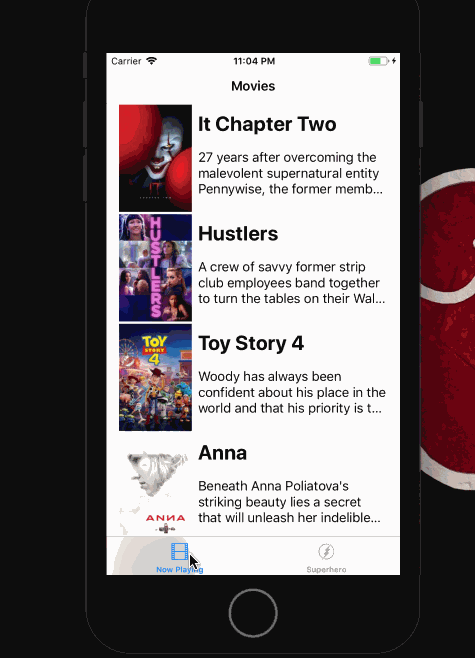
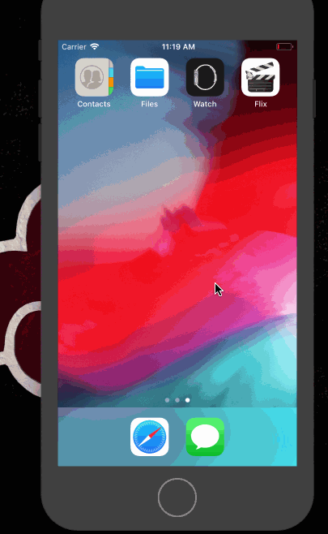

# Flix

Flix is an app that allows users to browse movies from the [The Movie Database API](http://docs.themoviedb.apiary.io/#).

## Flix Part 2

### User Stories

#### Functionality:
User can tap a cell to see more details about a particular movie.
User can tap a tab bar button to view a grid layout of Movie Posters using a CollectionView.
User can tap a poster in the collection view to see a detail screen of that movie.
User sees an app icon on the home screen and a styled launch screen.
User can view and scroll through a list of movies now playing in theaters.
User can view the movie poster image for each movie.
Capable of running on a real device.

### App Walkthough GIF

 

### App Walkthough GIF
 

### Notes:
