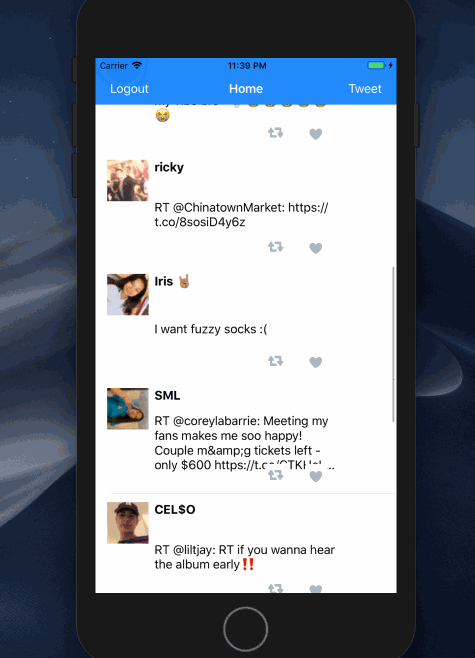
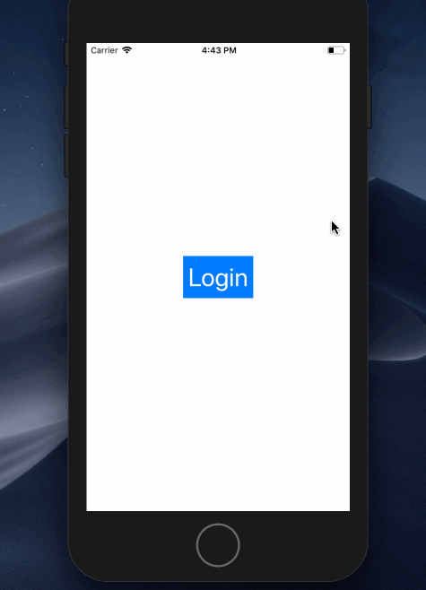

# Project 3 - *Twitter*

# Twitter - Part II

This is a basic twitter app to view, compose, favorite, and retweet tweets.

## Functionality:

- [x] User can compose a tweet. 
- [x] User can favorite a tweet.
- [x] User can retweet a tweet. 
- [x] User can log in. (1pt)
- [x] User can log out. (1pt)
- [x] User stays logged in across restarts. (1pt)
- [x] User can view tweets with the user profile picture, username, and tweet text. (6pts)
- [x] User can pull to refresh. (1pt)

## Video Walkthrough

Here's a walkthrough of implemented functionality:

**Twitter** is a basic twitter app to read your tweets.

## Video Walkthrough

Here's a walkthrough of implemented functionality:

